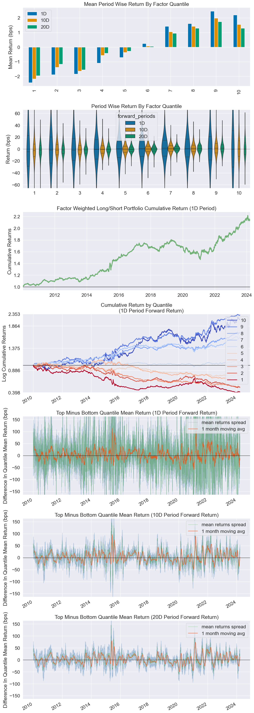
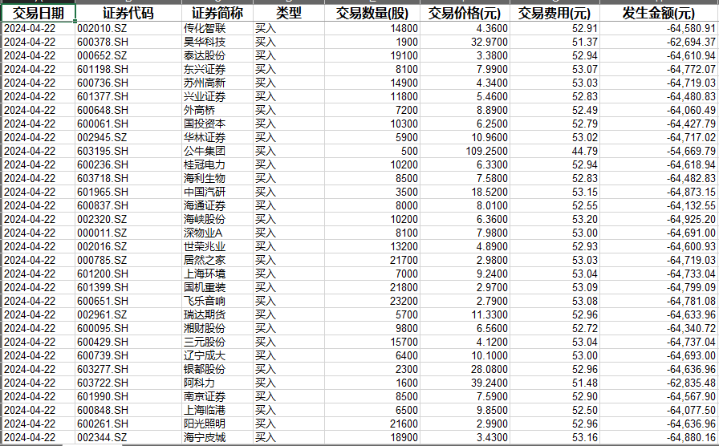
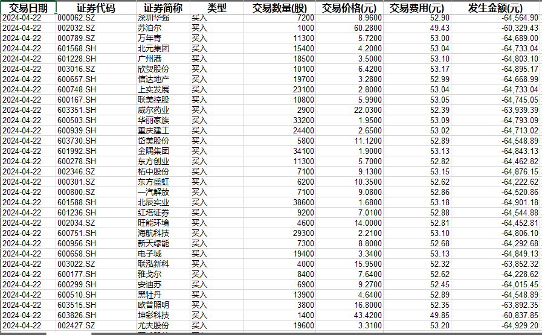
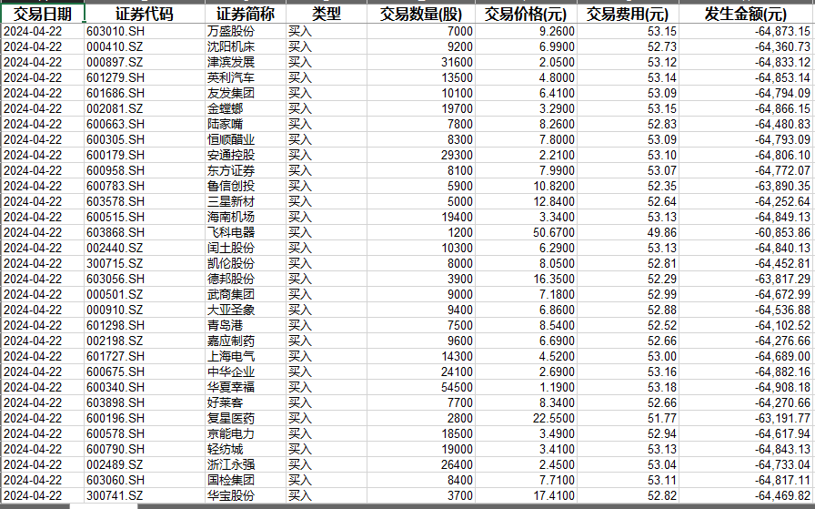
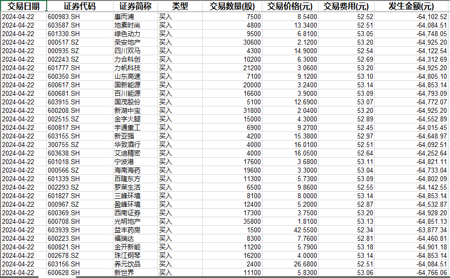
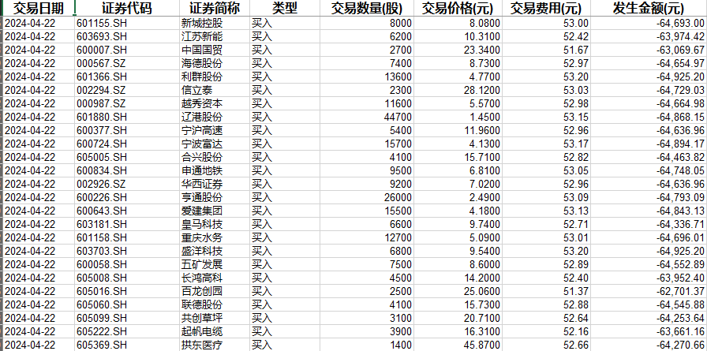
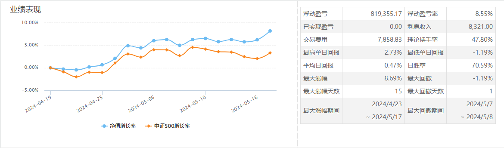

**IFactor = AI + Multifacor**
A multifactor model combinded with machine learning algorithm on China A-shares.

Support q_factor(Hou.[2015}]) and FF5(Fama.[2015]) to be continued.

AI model can't run without GPU...

Requirement:
Python 3.8.10
sklearn
dateutil
Alphalens-reloaded
Tushare
ArcticDB

Result:

1. Q_factor worked on A-share from 20100101 to 20240424, annual return(without commision) of Long/Short portfolio is about 2.5%, cumulative return is 145%, IC mean is 0.018.

Information Analysis
1D	10D	20D
IC Mean	0.007	0.014	0.018
IC Std.	0.050	0.059	0.061
Risk-Adjusted IC	0.135	0.243	0.291
t-stat(IC)	7.921	14.260	17.092
p-value(IC)	0.000	0.000	0.000
IC Skew	-0.061	-0.054	0.067
IC Kurtosis	0.553	1.080	0.594

2. Frankly speaking, the result of q_factor is under expectation, main reason is ROE factor which does not work on A-share, maybe it's suit for US market but not same with A-share, many reasons..

So, I simply replace ROE with PB, result is much better: annual return(without commision) of Long/Short portfolio is about 6.1%, cumulative return is 220%, IC mean is 0.043.

Information Analysis
1D	10D	20D
IC Mean	0.021	0.034	0.043
IC Std.	0.114	0.135	0.142
Risk-Adjusted IC	0.181	0.250	0.302
t-stat(IC)	10.660	14.669	17.768
p-value(IC)	0.000	0.000	0.000
IC Skew	0.112	0.168	0.162
IC Kurtosis	0.166	-0.462	-0.483

Simulated trading(keep updating)
Portpolio name: IFactor
Open position on April 22th, 2024
Trade details:

Performance from April 22th, 2024 to May 17th, 2024

To do:
1. Find more factors for A-share.
2. How to run deep learning model with my poor computer?

